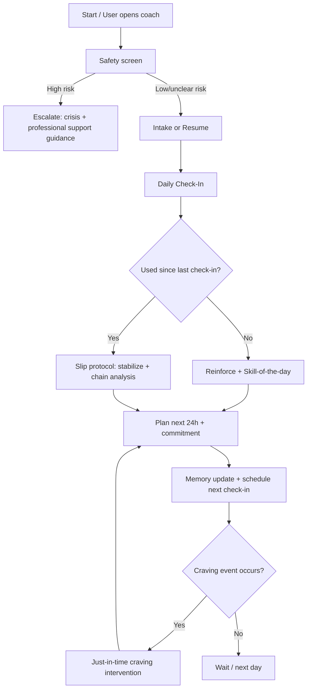
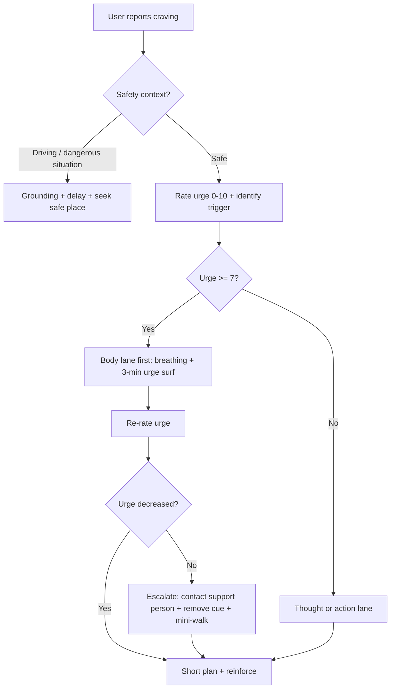

# Philosophies and CBT-Based Methods for Quitting Addictive Behaviors, With GPT-Wrapper Program Design

## Executive summary

Allen Carr–style quitting programs and QuitSure share a “desire-removal” thesis: **the central job is not to out-willpower cravings but to change the beliefs and fears that generate the felt need to use**. In their official materials, both explicitly frame quitting as *release* (freedom from a trap) rather than *loss* (deprivation), and both heavily downplay the severity of physical withdrawal relative to psychologically interpreted craving. citeturn5view1turn6view0turn5view2

CBT-based interventions (often combined with motivational interviewing) are more “skills-and-systems” oriented: they treat addiction as a learned, cue-driven, reinforcement-supported behavior pattern that can be modified through **motivation elicitation, cognitive change, behavioral replacement, coping skills, and relapse process planning**. Across substances, CBT has a large evidence base from controlled trials and meta-analyses; for smoking, clinical guidelines emphasize that behavioral counseling is effective and that intervention intensity (more sessions/time) tends to improve outcomes. citeturn8view5turn7view0turn5view7turn7view2

From a GPT-wrapper design perspective, the most defensible architecture is a **hybrid conversational system**: (1) MI micro-skills to build rapport and evoke “change talk,” (2) CBT modules that teach and rehearse coping skills with daily practice and logging, and (3) relapse-prevention logic that treats slips as data and re-engages users without shame. This maps cleanly to structured templates for intake, daily check-ins, craving interventions, and relapse handling. citeturn8view2turn7view3turn12view0turn9view2

Evidence-wise, Allen Carr’s seminar approach has **some controlled evidence but a limited literature overall**, and estimates vary across studies; QuitSure has published **single-arm and observational-style evidence with explicit calls for randomized, biochemically verified trials** to establish efficacy. CBT/MI approaches have **substantially stronger and broader empirical support** (though specific components like cue-exposure for smoking show mixed results). citeturn6view3turn5view5turn8view5turn9view0turn2search6

## Scope and sources

This report focuses on three method families requested: (a) Allen Carr–style “Easyway” quitting philosophy as represented in official materials and the flagship book, (b) QuitSure’s official program framing and published evaluation papers, and (c) core CBT-based interventions (including motivational interviewing, cognitive restructuring, behavioral activation, exposure/cue work, and relapse prevention) as described in major guidelines, manuals, and peer-reviewed reviews/meta-analyses. citeturn5view1turn6view0turn5view2turn5view4turn5view5turn5view7turn8view5turn9view0

Primary/official sources emphasized include the official site of entity["organization","Allen Carr's Easyway","smoking cessation program"] and QuitSure’s official pages; for bibliographic anchoring of the book-based approach, the report references entity["book","Allen Carr's Easyway to Stop Smoking","self-help smoking 1985"] (widely published in many editions). citeturn5view1turn5view0turn5view2turn4search25

Evidence-strength judgments use a practical hierarchy: **High** (multiple RCTs and/or meta-analyses across settings), **Moderate** (some controlled evidence but limited breadth, or mixed results), **Low** (single-arm, uncontrolled, strong conflicts-of-interest, or primarily marketing claims). This mirrors how major evidence syntheses and guidelines distinguish certainty and risk-of-bias concerns. citeturn9view2turn9view0turn5view7turn8view5

## Allen Carr and QuitSure

### Allen Carr–style “Easyway” principles, mechanisms, and persuasive framing

A core official claim is that the method **removes the “need/desire” to smoke and the fears that keep people trapped**, positioning fear (of withdrawal, deprivation, loss of coping) as a key maintenance factor. citeturn5view0turn5view1turn6view0

The persuasive framing relies on several recurring moves:

First, it asserts that **the dominant struggle is mental**, not physical. Official materials describe a “Little Monster” (physical nicotine addiction) and “Big Monster” (psychological conditioning/interpretation), emphasizing that discomfort largely comes from *perceived deprivation* rather than severe bodily pain. citeturn6view0turn6view1

Second, it reframes smoking as a **cycle of relief from the previous cigarette**, rather than a true benefit; the “relief” story is used to argue that smoking creates and then temporarily relieves discomfort, sustaining repeated use. citeturn6view1turn6view3

Third, it positions quitting as **compatible with normal life** (no special lifestyle changes, no avoiding coffee/socializing) and presents quitting as *gain* (freedom, relaxation) rather than sacrifice, a persuasion strategy that aims to reduce loss aversion and anticipatory anxiety about quitting. citeturn5view0turn5view1turn6view0

Fourth, it rejects substitutes and willpower-based struggle as the primary path, advertising “no substitutes/medications” and “no bad withdrawal symptoms” as part of the program’s appeal. citeturn5view1turn5view0

Mechanisms of change (as inferred from the above primary claims) center on **expectancy change and cognitive reappraisal**: if cigarettes are no longer conceptualized as valuable or needed, the same withdrawal signal is interpreted as transient and non-compelling, reducing craving escalation and strengthening identity as a “non-smoker.” This is aligned with the official explanation that how one *sees* cigarettes determines whether withdrawal becomes “craving.” citeturn6view1turn6view0

### QuitSure principles, mechanisms, and persuasive framing

QuitSure’s official framing is similarly “desire-removal” and anti-willpower: it markets “Smoke-Free in 6 Days with NO CRAVINGS,” explicitly says it does not require willpower, and claims it “removes the desire to smoke,” while also emphasizing “no guilt” and respect for users. citeturn5view2turn6view4

QuitSure also emphasizes **no nicotine replacement** (“no chewing gums/vapes”) and “not replacing one bad habit with another,” paralleling the anti-substitution posture common in Easyway-style marketing. citeturn5view2turn6view4

In published descriptions of its intervention components, the QuitSure app is described as a **personalized 6-day, self-guided program** requiring ~6–10 hours of reading/videos, with an onboarding assessment of smoking habits and features that include a quit plan, mindfulness activities, motivational content, and coaching/chat support; it states it does not recommend pharmacotherapy and instead draws on CBT, mindfulness, and positive psychology. citeturn5view4turn6view2

The persuasive framing in the commercial landing pages adds strong performance assertions (“95% success rate,” “clinically proven,” “trusted by 3 million+”), which should be treated as marketing claims unless tied to independently verified, controlled outcomes. citeturn6view4turn5view3

### Evidence status and key limitations

A 2023 systematic review of Allen Carr’s method concludes that the seminar approach **may be effective** but that evidence is limited: among six included studies (2006–2020), two were RCTs and results were mixed across comparisons; reported cessation rates for seminar attendees ranged roughly from 19% to 51%, and the authors call for larger RCTs, with scant data for the book-alone approach. citeturn6view3

QuitSure has published prospective, single-arm findings reporting high self-reported abstinence outcomes and symptom reductions, but the same paper explicitly notes the need for appropriate controls to obtain conclusive evidence. citeturn6view2turn5view4 A separate QuitSure-related paper in JMIR Human Factors similarly emphasizes limitations such as sample representativeness and explicitly calls for a randomized controlled trial with biochemical verification of cessation to establish feasibility and efficacy. citeturn5view5turn0search7

From a mechanism standpoint, both Allen Carr materials and QuitSure emphasize psychological reframing; however, QuitSure’s academic framing also acknowledges standard cessation guidance (e.g., NRT recommendations by major authorities) while noting that QuitSure does not include NRT, a gap that matters when comparing it to guideline-concordant tobacco care. citeturn5view5turn5view7turn7view5turn8view4

image_group{"layout":"carousel","aspect_ratio":"1:1","query":["Allen Carr Easy Way to Stop Smoking book cover","Allen Carr Easyway stop smoking seminar photo","QuitSure quit smoking app screenshot","CBT thought record worksheet example"],"num_per_query":1}

## Core CBT-based quitting interventions

### Conceptual model shared across CBT approaches

In CBT for addictive behaviors, the “problem” is typically formulated as an interaction among **triggers/cues, thoughts and beliefs, emotions/physiology, and behavior**, reinforced by short-term relief or reward. CBT then targets modifiable links: beliefs/expectancies, coping skills, alternative reinforcement, and high-risk decision chains. citeturn7view0turn8view5turn12view0

For smoking specifically, modern CBT protocols often combine skills training (problem solving, coping skills, cognitive restructuring) with evidence-based cessation recommendations (e.g., identifying triggers, mood management), and clinical guidance emphasizes that **higher-intensity counseling tends to yield better cessation outcomes** than minimal/brief support. citeturn7view2turn5view7turn1search18

### Motivational interviewing

**Core principles and mechanisms.** MI is designed to resolve ambivalence by **evoking** a person’s own reasons for change (“change talk”) while minimizing confrontational persuasion (“sustain talk” is acknowledged rather than argued against). The NCBI/SAMHSA-aligned description emphasizes OARS (open questions, affirmations, reflections, summaries) and DARN-CAT (desire, ability, reasons, need → commitment, activation, taking steps) as a structure for eliciting motivation and strengthening commitment. citeturn8view2turn5view8

**Evidence strength.** Cochrane reviews indicate MI may help smoking cessation compared with brief advice/usual care in some contexts, but overall findings are sensitive to study heterogeneity, MI fidelity, and comparator type; the 2019 update highlights low-to-moderate certainty across comparisons and notes that MI can be difficult to deliver with consistent fidelity. citeturn9view1turn9view0

**Typical session elements.** MI sessions commonly include: collaboratively setting the target behavior, exploring ambivalence, eliciting change talk via open questions and scaling rulers, reflective summaries to consolidate motivation, and a transition to planning when readiness increases. citeturn8view2turn5view8turn8view4

### Cognitive restructuring

**Core principles and mechanisms.** Cognitive restructuring targets the appraisals and beliefs that drive use (e.g., “I can’t cope without it,” “one won’t hurt,” “it’s the only way to relax”), aiming to replace them with more accurate, less triggering interpretations and behavioral experiments. In smoking-specific CBT, cognitive restructuring is often named explicitly as part of the package alongside coping/problem-solving skills. citeturn7view2turn7view3turn8view4

**Evidence strength.** As a component of CBT, cognitive restructuring inherits evidence from broader CBT outcome literature across substance use disorders (and smoking protocols that explicitly include cognitive restructuring as a technique set). Meta-analytic work supports CBT as effective compared to minimal/nonspecific controls, with smaller or nonsignificant differences versus other bona fide therapies—consistent with many psychotherapy evidence patterns. citeturn8view5turn7view0

**Typical session elements.** Common clinical elements include: identifying high-risk moments, capturing an “automatic thought,” labeling the common distortion/expectancy, evaluating evidence and consequences, generating an alternative thought, and rehearsing a coping statement for the next urge episode. Smoking cessation counseling resources explicitly encourage cognitive strategies like treating “thinking about a cigarette” as not requiring action. citeturn7view3turn8view4

### Behavioral activation

**Core principles and mechanisms.** Behavioral activation (BA) changes behavior by **systematically increasing access to rewarding, value-consistent non-use activities** and reducing avoidance/withdrawal patterns that often follow quitting. In addiction contexts, BA is used to counter the “reinforcement gap” created when a substance or habit is removed. citeturn5view10turn12view0

**Evidence strength.** A systematic review of BA for substance use and depression found promising but heterogeneous evidence with small samples and recommended better-controlled studies; nonetheless, most included studies showed positive substance-use outcomes. citeturn5view10 In smoking cessation, BA components have been tested within CBT packages (including RCTs comparing CBT with vs. without BA components), supporting BA as a plausible enhancement especially where mood/low reinforcement is prominent. citeturn2search20turn2search4

**Typical session elements.** BA sessions typically include values clarification, activity monitoring (“what did you do, how rewarding was it?”), graded scheduling of small activities in high-risk windows, and troubleshooting barriers—aligning naturally to app-based daily planning. citeturn5view10turn12view0

### Exposure and cue-focused work

**Core principles and mechanisms.** Cue exposure approaches aim to reduce cue-elicited craving by repeated, controlled exposure to triggers without using, often paired with coping practice (response prevention) so the cue→use association weakens. citeturn2search14turn2search2

**Evidence strength.** For smoking, evidence is mixed: some experimental/VR cue exposure work shows reductions in craving, yet at least one randomized clinical trial reported no added benefit (and potential relapse risk signals) when cue exposure was added to established CBT smoking cessation treatment. citeturn2search14turn2search6turn2search2

**Typical session elements.** When used, cue work is typically (a) carefully titrated by risk, (b) paired with coping rehearsal and safety planning, and (c) avoided when the user is unstable or lacks supports—implying a GPT wrapper should treat cue exposure as optional/advanced and default to lower-risk strategies (urge surfing, cognitive coping, action substitution) unless a clinician-designed protocol exists. citeturn2search6turn12view0

### Relapse prevention and continuing care

**Core principles and mechanisms.** Relapse prevention (RP) treats relapse as a process involving high-risk situations, coping responses, outcome expectancies, and self-efficacy; it emphasizes anticipating “seemingly irrelevant decisions,” rehearsing coping skills, and reframing slips to avoid spirals. citeturn4search8turn12view0

**Evidence strength (smoking-specific).** A Cochrane review focused on relapse prevention after smoking cessation found **no clear support for behavioral relapse-prevention treatments** in preventing relapse, while extended pharmacotherapy showed more promise (with varying certainty). citeturn9view2 This matters for GPT design: relapse-prevention conversations may still be valuable for user experience and engagement, but claims about reducing relapse rates should be modest unless paired with evidence-based cessation supports. citeturn9view2turn5view7

**Evidence strength (across addictions).** CBT packages that include relapse-prevention skills show efficacy across substance use disorders relative to minimal/nonspecific controls in meta-analytic work, framing RP as a central CBT mechanism even if any single RP sub-technique varies by context. citeturn8view5turn7view0turn12view0

**Typical session elements.** Many tobacco cessation counseling guides explicitly include: identifying triggers, planning coping strategies, distinguishing “slip vs relapse,” and arranging follow-up—elements that translate directly to daily GPT check-ins and relapse protocols. citeturn7view4turn8view4turn7view3

## Comparative analysis and expected outcomes

The table below compares Allen Carr–style Easyway, QuitSure, and CBT/MI-based quitting interventions on philosophy, delivery, expected outcomes, and evidence level. “Expected outcomes” are presented as **what each method aims/claims** and/or what published studies reported, with explicit caveats about study design.

| Method family | Core philosophy & framing | Typical delivery | Expected outcomes (practical) | Evidence level (as of cited sources) |
|---|---|---|---|---|
| Allen Carr (“Easyway”) | Reframe quitting as freedom (not sacrifice); reduce fear/deprivation; downplay physical withdrawal vs psychological craving; “remove desire” rather than “endure cravings.” citeturn5view0turn6view0turn6view1 | Book, seminars, online video programs; marketed as no substitutes/medications and minimal lifestyle change. citeturn5view1turn5view0 | Seminar studies in a systematic review showed cessation rates roughly 19%–51% with mixed comparative results; book-only evidence described as scant. citeturn6view3 | Moderate-to-low: limited number of controlled studies; mixed RCT findings and heterogeneity; needs larger RCTs. citeturn6view3 |
| QuitSure | “No willpower/no guilt”; mindset change to stop craving; no NRT/substitution; short structured program (6 days). citeturn5view2turn6view4 | App-based 6-day program with reading/video, mindfulness, motivational content, coaching/chat; states it does not recommend pharmacotherapy and uses CBT/mindfulness/positive psychology. citeturn6view2turn5view4 | Single-arm/prospective results report high self-reported abstinence and symptom reduction; authors call for controlled trials; separate paper calls for RCT with biochemical verification. citeturn6view2turn5view5 | Low-to-moderate: published data exist but key limitations (no control/verification) explicitly acknowledged; strong marketing claims exceed available independent evidence. citeturn5view5turn6view4 |
| CBT + MI (guideline-concordant) | Skill-building plus motivation elicitation; treat urges as cue-driven and manageable; focus on coping, restructuring beliefs, alternative reinforcement, and ongoing support. citeturn8view2turn7view2turn12view0 | Multi-session individual or group counseling; intensity associated with better outcomes; often combined with smoking cessation medications in clinical settings for smoking. citeturn7view2turn5view7turn7view5 | Across substances, CBT shows better outcomes than minimal/nonspecific controls in meta-analysis; for smoking, behavioral therapies are effective and combining counseling + medication is emphasized in major guidance. citeturn8view5turn5view7turn8view4 | High (CBT overall across SUD); Moderate-to-high for smoking behavioral counseling; MI for smoking: moderate but heterogeneous with fidelity concerns. citeturn8view5turn5view7turn9view0turn9view1 |

A key analytic takeaway is that Allen Carr–style approaches and QuitSure are optimized for **rapid belief change and emotional reassurance (“you’re not losing anything; cravings are weak; you can be free now”)**, whereas CBT/MI systems are optimized for **repeated skill rehearsal and environment shaping**, which better supports a GPT wrapper’s daily coaching model. citeturn6view0turn5view2turn7view3turn12view0

## Mapping CBT techniques to GPT conversational strategies and templates

### Translation layer: from therapy technique to “dialogue moves”

A GPT wrapper should implement a small set of reliable “dialogue primitives” that are reused across modules:

**Open questions → reflections → summaries → next-step planning.** This is the core MI loop (OARS) and should be the default interaction rhythm because it increases perceived empathy (“you heard me”) while producing structured data for personalization and memory. citeturn8view2turn5view8turn8view4

**Elicit “change talk” before giving advice.** MI emphasizes evoking reasons/need/ability and then transitioning into planning when readiness emerges; in software, this means: ask permission, ask what they want, reflect, then offer options. citeturn8view2turn5view8

**Normalize cravings and separate “thought ≠ action.”** Tobacco cessation coping guides explicitly teach that thinking about a cigarette does not mean you need one; this maps to chatbot coaching that labels urges as temporary events. citeturn7view3turn8view4

**Treat slips as data, not failure.** Standard cessation counseling includes explicit “slip vs relapse” language, which can be operationalized as: stabilize → analyze trigger chain → revise plan → recommit. citeturn7view4turn9view2turn12view0

Below are technique-specific mappings, followed by reusable templates and sample dialogue snippets.

### Motivational interviewing module

**Conversational strategies**

- **Engage and focus:** “What feels most important to change right now?” (target behavior selection) citeturn8view2  
- **Evocation via DARN-CAT prompts:** ask about desire/ability/reasons/need, then invite commitment/activation/steps. citeturn8view2  
- **Confidence and importance rulers:** ask “0–10” and then the standard MI follow-up (“Why not lower?”) to elicit change talk. citeturn8view2turn8view4  
- **Double-sided reflections for sustain talk:** “Part of you wants X, and part of you worries Y.” citeturn8view2  

**Sample GPT dialogue flow (MI “readiness-building”)**

> **User:** I know I should quit, but it helps my stress.  
> **GPT:** It makes sense that you’d hesitate if it feels like stress relief. And you’re also noticing a “should” to quit.  
> **GPT:** When stress hits, what do you notice smoking *does immediately*—and what does it cost you later?  
> **User:** It calms me for a minute… then I’m annoyed at myself.  
> **GPT:** So you get a short calm, and then self-frustration.  
> **GPT:** On a 0–10 scale, how important is it to quit right now? What makes it that number and not lower?

(Structure grounded in MI processes: reflection, discrepancy, scaling, evocation. citeturn8view2turn5view8)

### Cognitive restructuring module

**Conversational strategies**

- **Thought capture:** “In that moment, what was the sentence your mind said that pushed you toward using?”  
- **Belief testing:** “What’s the best evidence for that? What’s the best evidence against it?”  
- **Functional reframe:** “If that thought were 20% less ‘true,’ what would you do instead for 5 minutes?” (links cognition to behavior)  
- **Coping statement rehearsal:** “What’s a one-line reminder you can repeat during the next urge?” (mirrors coping guides’ “self-talk” and mental rehearsal) citeturn7view3  

**Micro-template (token-light)**
- Trigger → Thought → Feeling/body → Action urge → Alternative thought → Alternative action → Result.

(CBT smoking-cessation resources emphasize cognitive strategies and rehearsal of responses to high-risk situations. citeturn7view3turn7view2)

### Behavioral activation module

**Conversational strategies**

- **Reinforcement audit:** “If you quit, what rewarding thing disappears from your day—and what could replace that reward?”  
- **Values-to-actions mapping:** “Which matters more to you right now—health, independence, money, or being present? What’s one 10-minute action that fits that value today?”  
- **Schedule the high-risk window:** “When is your most predictable craving time? Let’s pre-book a replacement activity for that slot.”

(BA mechanisms and promise in addiction contexts are described as increasing constructive, rewarding activity and retention/abstinence likelihood in some studies. citeturn5view10turn2search5turn12view0)

### Exposure/cue-focused (optional/advanced) module

**Conversational strategies (low-risk default)**
- Prefer “cue *planning*” over cue exposure: identify cues and build coping scripts without deliberately provoking high craving.
- If doing any cue imagery: short duration, immediate coping, exit plan, and avoid if user reports instability.

(This caution follows mixed evidence and possible relapse-risk signals in at least one smoking CET RCT, while acknowledging experimental promise in some VR CET contexts. citeturn2search6turn2search2turn2search14)

### Relapse prevention module

**Conversational strategies**

- **High-risk map:** “What are your top 3 relapse situations: emotion, place, people?”  
- **Decision-chain interruption:** “What’s the earliest moment you could do something different next time?”  
- **Slip recovery script:** “A slip is information, not identity. What do we change in the plan?” (aligns with “slip vs relapse” counseling guidance) citeturn7view4turn12view0  

**Note on smoking-specific evidence:** While relapse-prevention conversations are common in counseling guides, smoking relapse-prevention *behavioral* interventions show limited evidence of preventing relapse in Cochrane analyses; this suggests the GPT wrapper should treat RP as supportive coaching, not as a guaranteed relapse firewall. citeturn9view2turn7view4

### Reusable templates for a GPT wrapper

#### Intake template

```text
1) Goal + target behavior
- What are you trying to quit or reduce (what, how often, how long)?
- What does a “win” look like (abstinence vs reduction, and by when)?

2) Pattern mapping
- Top 3 trigger situations (time/place/emotion/people).
- What you get from it (relief, reward, numbness, focus, belonging).
- What you dislike about it (costs, health, control, self-respect).

3) Motivation + confidence
- Importance (0–10). Why not lower?
- Confidence (0–10). What would raise it by 1 point?

4) Past attempts
- What helped even a little?
- What caused slips/relapse?

5) Preferences + boundaries
- Tone: gentle / direct / humorous?
- Daily check-in time window.
- Privacy: what should never be stored?

6) Safety screen (non-medical)
- Any current crisis, self-harm thoughts, severe withdrawal risk, or need for medical support?
```

(Elements mirror standard cessation counseling assessment items: history, triggers, motivation/confidence, reasons for relapse, and follow-up planning. citeturn7view4turn12view0turn8view2)

#### Daily check-in template

```text
A) Status
- Since last check-in: used/not used? If used, how much?
- Craving intensity (0–10) peak + typical.

B) Biggest risk moment
- What was the riskiest moment today (time/place/emotion)?
- What thought showed up?

C) Skill-of-the-day (pick one)
- 60-second reflection + one action plan for tomorrow’s high-risk window.

D) Commitment
- “What’s your smallest doable commitment for the next 24 hours?”
- Confidence (0–10). If <7: “What would make it easier?”
```

(Scaling, eliciting plan details, and self-monitoring logic parallel MI/behavioral counseling guidance and tobacco cessation manuals. citeturn8view2turn8view4turn7view4)

#### Craving intervention template (just-in-time)

```text
Step 1: Name it + timebox
- “How strong is the urge (0–10)?” “Can we try a 3-minute reset?”

Step 2: Choose a lane (user picks)
1) Body lane: breathing + urge-surf timer
2) Thought lane: “What is the urge claiming you need right now?”
3) Action lane: 5-minute replacement task (walk/water/text someone)

Step 3: Reappraise
- “What will you feel in 10 minutes if you don’t use?”
- “What will you feel in 10 minutes if you do?”

Step 4: Close + reinforce
- Reflect what worked.
- Store one micro-learning: “Next time, do X first.”
```

(“Cravings are temporary,” self-talk, and mental rehearsal are explicitly recommended coping strategies in tobacco cessation materials; MI-style reflection and future planning improve adherence. citeturn7view3turn8view2turn12view0)

#### Relapse handling template

```text
1) Stabilize (no shame)
- “Thanks for telling me. A slip is data.”

2) Define: slip vs relapse (behaviorally)
- “Was it one episode or are you back to the old pattern?”

3) Chain analysis (fast)
- Trigger → Thought → Feeling → Action → Immediate payoff → Later cost

4) Fix the system
- Pick one prevention change (environment, coping, schedule, support).

5) Recommit
- “What’s the next right action in the next hour?”
- “Do you want a ‘restart plan’ for the next 24 hours?”
```

(This aligns with counseling guidance to address slips/relapse, reassess triggers, and arrange continued support; and with the chronic-care framing of addiction requiring ongoing adjustment. citeturn7view4turn12view0turn9view2)

#### Motivational boost template

```text
- Reflect effort + identity: “You’re practicing being the person who ______.”
- Link to values: “This is about ______ (health/family/freedom).”
- Recall past success: “What helped you get through a hard urge before?”
- Make one small plan: “What’s the smallest step you’ll do today?”
```

(MI and motivation-enhancement materials emphasize affirmations, self-efficacy, and linking values to change goals. citeturn8view2turn5view8turn8view4)

## Program architecture for a GPT wrapper

### Memory schema

A quitting coach wrapper needs **stable memory** (long-lived personalization) and **episodic logs** (daily outcomes). The memory should be minimal, user-auditable, and purpose-bound (only what improves coaching).

**Proposed schema (conceptual)**

- **Identity & goals:** target behavior; quit vs reduce; start date; definition of “success.”  
- **Motivation profile:** top reasons (values); strongest “change talk” statements; readiness stage signals. citeturn8view2turn5view8  
- **Trigger map:** top cues; top emotions; top contexts; social influences. citeturn7view4turn12view0  
- **Coping library:** best 3 strategies that worked; “first-response” plan; relapse recovery plan. citeturn7view3turn7view4  
- **Constraints & preferences:** tone, time-of-day check-ins, boundaries, privacy redlines.  
- **Risk flags:** user-stated contraindications or safety concerns; escalation preferences and local resources info (if provided). citeturn12view0turn8view4  

### Session sequencing

A practical sequencing that fits both MI and CBT is:

- **Session 0 (onboarding):** intake + motivation + trigger map + first micro-plan. citeturn8view2turn7view4  
- **Days 1–7 (skills sprint):** daily check-in + one skill module (urge coping, thought work, BA scheduling, social scripts). This matches the general principle that repeated contact supports behavior change and resembles QuitSure’s short structured approach while staying CBT-consistent. citeturn6view2turn5view4turn7view2  
- **Weeks 2–4 (stabilization):** fewer but regular check-ins; relapse-prevention planning; identity consolidation; reward replacement planning. citeturn12view0turn7view3  
- **Maintenance (monthly):** brief “health check” and rapid re-entry to daily mode after any slip.

This progression mirrors a chronic-care view of addiction where ongoing monitoring and adjustment are expected, not exceptional. citeturn12view0

### Adherence nudges

Adherence mechanisms should be autonomy-supportive (MI-consistent): reminders framed as options, not commands; celebrate partial completion; allow “tiny versions” of tasks. citeturn8view2turn5view8

Examples of ethical nudges:
- “Want to do the 60‑second version today?” (reduces friction)
- “Pick one: craving tool or tomorrow plan.” (choice architecture)
- “Would you like me to remember this trigger pattern?” (consentful memory update)

### Personalization variables

High-impact personalization variables (low privacy cost):
- Trigger windows (time-of-day), top contexts, and preferred coping style. citeturn7view4turn7view3  
- Readiness level and confidence; these guide whether the bot should do MI (evoke) versus CBT planning (act). citeturn8view2  
- Prior successful attempts and failed points (for pre-emptive planning). citeturn7view4turn12view0

### Safety and triage triggers

A GPT quitting coach must have explicit “stop-and-escalate” logic. The rationale is that addiction treatment is multi-dimensional and may require medical and mental health care; detoxification and co-occurring disorders can require professional support. citeturn12view0turn5view8

Trigger examples (non-exhaustive):
- **Self-harm or suicidal ideation** → crisis escalation pathway (local emergency/crisis resources).
- **Severe withdrawal risk or medically risky substances** (user-reported) → advise contacting a clinician or emergency services; do not provide medical detox instructions. citeturn12view0  
- **Psychosis/mania, severe depression, intoxication impairing consent** → recommend professional evaluation and reduce coaching intensity. citeturn12view0turn5view8  
- **Domestic violence/coercion** affecting ability to quit safely → offer resources, safety planning prompts (non-clinical). citeturn12view0  

### Ethical constraints

A safe system should:

- Avoid claiming guaranteed outcomes, especially when evidence is limited (relevant for marketing-style claims like “no cravings” or “95% success”). citeturn6view4turn5view5  
- Separate **education** from **medical advice**; refer users to clinicians for medication and withdrawal management, consistent with major guidance that medications can be important for many patients but must be appropriately managed. citeturn5view7turn12view0turn8view4  
- Make data use transparent, minimize sensitive storage, and allow deletion requests.

### Program flowcharts

**Program flow (high-level)**



**Craving decision tree (just-in-time)**



## Implementation notes: prompts, memory compression, privacy, and evaluation

### Prompt engineering examples

A robust prompt stack typically separates:

- **System policy:** non-medical, non-judgmental, evidence-aligned tone; use MI skills; avoid guarantees; store minimal memory; escalate on safety triggers. citeturn8view2turn12view0turn5view5  
- **Developer “conversation contract”:** enforce OARS, require a daily completion step, and require a “next action” close. citeturn8view2turn7view4  
- **User context:** target behavior + preferences + trigger map.

Example “coach style” excerpt (illustrative):

```text
You are a quitting coach. Use OARS (open questions, affirmations, reflections, summaries).
Evoke the user's reasons for change before offering suggestions.
Never provide medical advice; recommend professional help for medication/withdrawal risks.
Do not promise outcomes. Focus on skills practice, planning, and supportive accountability.
End each interaction with one concrete next step and a time for the next check-in.
```

(OARS and evocation-based counseling are core MI skills; ongoing monitoring and adjustment align with evidence-based addiction care principles. citeturn8view2turn12view0)

### Token-efficient memory prompts

A common pattern is to treat memory updates as a separate internal step that produces a short JSON-like summary.

**Example “memory update” instruction**

```text
MEMORY UPDATE (max 80 tokens):
Store only stable preferences + high-signal quitting variables.
Schema:
- goal, stage, top_triggers[<=3], top_reasons[<=3], best_coping[<=3],
- relapse_risks[<=2], checkin_time_window, tone_pref, dont_store[]
Output compact JSON. If nothing new, output {}.
```

This supports the evidence-based principle that ongoing treatment should be monitored and adjusted while keeping the system’s stored data minimal and relevant. citeturn12view0turn7view4

### Privacy considerations

Because quitting data can be sensitive (substance use, mental health, relationships), privacy-by-design should include: data minimization, explicit consent for any long-term storage, user inspection/deletion, and avoidance of storing highly identifying details unless essential. This is an ethical necessity even when not explicitly required by cessation guidelines, and it prevents harmful misuse of behavioral data patterns. citeturn12view0turn5view8

### Evaluation metrics

To evaluate effectiveness without overstating causality:

**Engagement and adherence**
- Daily active users; completion rate of daily check-ins; time-to-dropoff; percentage of users who complete a multi-day core sequence (e.g., 7-day sprint).  
- “Just-in-time” usage: number of craving interventions initiated and completed.

**Behavioral outcomes (self-report, with clear labeling)**
- 7-day point-prevalence abstinence at 7/30/90/180 days (common in cessation research reporting) and/or continuous abstinence where feasible. citeturn9view0turn6view2  
- Reduction metrics for users choosing harm reduction (e.g., average daily use), consistent with addiction-care frameworks that recognize both abstinence and harm reduction outcomes. citeturn8view5turn12view0  

**Quality and safety**
- Rate of successful safety escalations; false positives/negatives; user-reported helpfulness; complaint rates.

QuitSure’s published work illustrates both the appeal and limitations of self-reported outcomes and explicitly points to biochemical verification as a stronger design for definitive efficacy claims. citeturn5view5turn6view2

### Recommended visuals and charts for the product

A GPT wrapper can materially improve comprehension and adherence using a small set of consistent visuals:

- **Trigger map / heatmap** (time-of-day × context): reflects the trigger-identification emphasis in cessation counseling. citeturn7view4turn12view0  
- **Urge curve chart** (intensity vs minutes): reinforces the “cravings pass” coping message used in cessation materials. citeturn7view3turn8view4  
- **Streak + recovery view** (shows “streak,” “slips,” and “rapid recovery”): supports a non-shame model aligned with chronic-care relapse expectations. citeturn12view0turn9view2  
- **Skill library cards** (OARS prompts, coping statements, BA activity ideas): operationalizes CBT/MI into reusable micro-tools. citeturn8view2turn7view3turn5view10